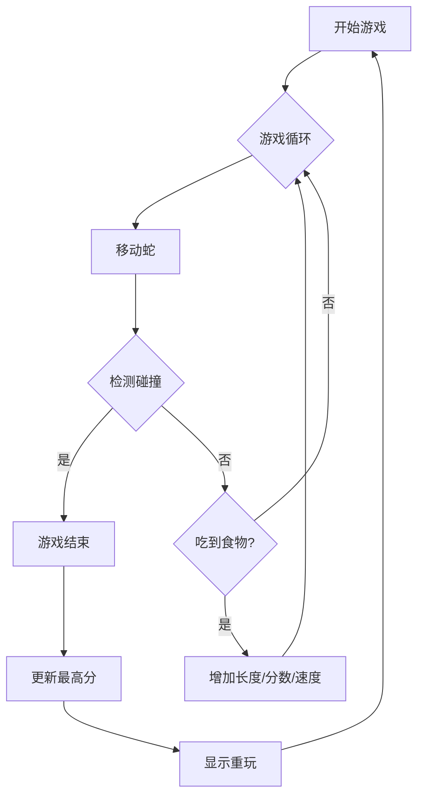

## 1. 产品概述
这是一个基于Web的现代化贪吃蛇游戏。它结合了经典的贪吃蛇玩法与现代极简主义或霓虹风格的视觉设计。
目标用户是所有年龄段的休闲玩家，旨在提供流畅、美观且具有挑战性的游戏体验。

## 2. 核心功能

### 2.1 用户角色
本游戏为单机游戏，无需用户注册。所有数据（如最高分）存储在本地浏览器中。

### 2.2 功能模块
1. **游戏主界面**: 包含游戏画布、当前分数、最高分显示、控制按钮（开始/暂停/重置）。
2. **游戏结束界面**: 显示最终得分，提供重新开始选项。
3. **设置/说明**: 简要说明操作方式（键盘方向键或屏幕按钮）。

### 2.3 页面详情
| 页面名称 | 模块名称 | 功能描述 |
|---|---|---|
| 主页 | 游戏区域 | 渲染蛇、食物、网格背景。响应键盘事件控制蛇的移动。 |
| 主页 | 计分板 | 实时显示当前分数，从本地存储读取并显示最高分。 |
| 主页 | 控制区 | 开始、暂停、重新开始按钮。移动端适配的方向控制按钮。 |

## 3. 核心流程
用户打开网页 -> 显示欢迎/开始界面 -> 点击开始 -> 游戏进行中（蛇移动、吃食物、变长、加分、加速） -> 撞墙或撞自身 -> 游戏结束 -> 更新最高分 -> 显示重玩选项。

## 4. 用户界面设计
### 4.1 设计风格
- **风格**: 霓虹赛博朋克 (Neon Cyberpunk) 或 极简主义 (Minimalist)。建议采用深色背景配以鲜艳的霓虹色（如荧光绿、亮粉色）。
- **颜色**:
    - 背景: 深灰或黑色 (#1a1a1a)
    - 蛇身: 荧光绿 (#00ff00) 或渐变色
    - 食物: 亮红色 (#ff0000) 或发光效果
- **字体**: 使用类似 'Press Start 2P' 的像素字体或现代无衬线字体 (如 'Inter', 'Roboto')。
- **动画**: 蛇移动的平滑过渡，吃食物时的粒子特效，游戏结束时的震动效果。

### 4.2 页面设计概览
| 页面名称 | 模块名称 | UI 元素 |
|---|---|---|
| 主页 | 整体布局 | 居中布局，适配桌面和移动端。 |
| 主页 | 游戏画布 | 带有微弱网格线的深色容器，边框发光。 |

### 4.3 响应式设计
- 桌面端支持键盘方向键 (↑, ↓, ←, →) 和 WASD 控制。
- 移动端提供虚拟方向键或手势滑动控制。
- 游戏画布大小随屏幕尺寸自适应调整。
